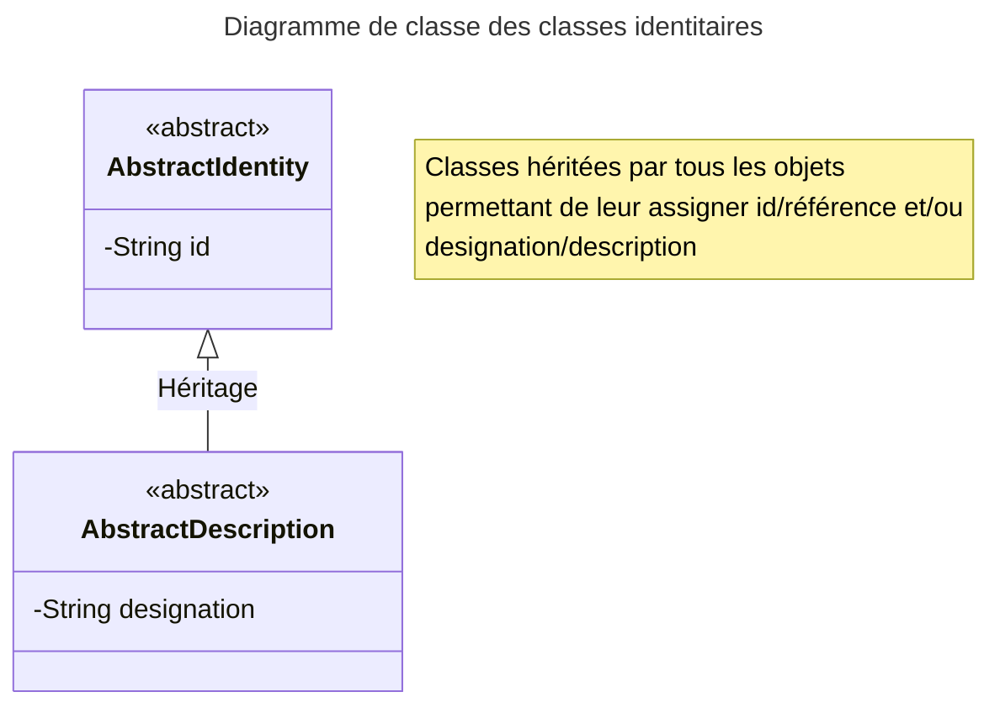
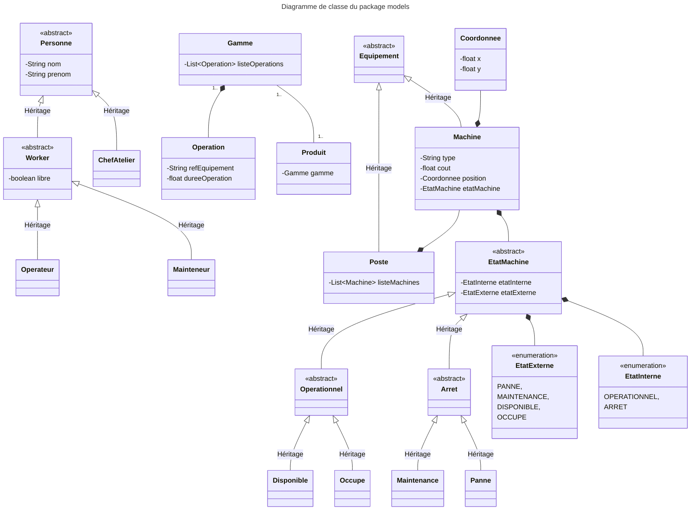

# Diagramme de classe

```mermaid
---
title: Diagramme de classe des classes identitaires
---
classDiagram
    note "Classes héritées par tous les objets
permettant de leur assigner id/référence et/ou
designation/description"
%% Classe pour définir un id/référence unique
    class AbstractIdentity {
        <<abstract>>
        -String id
    }

%% Classe pour définir une designation/description/libelle

    class AbstractDescription {
        <<abstract>>
        -String designation
    }

    AbstractIdentity <|-- AbstractDescription: Héritage
```

```mermaid
---
title: Diagramme de classe du package models
---
classDiagram
    class Personne {
        <<abstract>>
        -String nom
        -String prenom
    }

    class Worker {
        <<abstract>>
        -boolean libre
    }

    class Operateur {
    }

    class ChefAtelier
    class Mainteneur

    class Operation {
        -String refEquipement
        -float dureeOperation
    }

    class Gamme {
        -List~Operation~ listeOperations
    }

    class Produit {
        -Gamme gamme
    }

    class Equipement {
        <<abstract>>
    }

    class EtatInterne {
        <<enumeration>>
        OPERATIONNEL,
        ARRET
    }

    class EtatExterne {
        <<enumeration>>
        PANNE,
        MAINTENANCE,
        DISPONIBLE,
        OCCUPE
    }

    class EtatMachine {
        <<abstract>>
        -EtatInterne etatInterne
        -EtatExterne etatExterne
    }

    class Operationnel {
        <<abstract>>
    }

    class Arret {
        <<abstract>>
    }

    class Disponible
    class Occupe
    class Maintenance
    class Panne

    class Machine {
        -String type
        -float cout
        -Coordonnee position
        -EtatMachine etatMachine
    }
    class Poste {
        -List~Machine~ listeMachines
    }
    class Coordonnee {
        -float x
        -float y
    }

    Equipement <|-- Poste: Héritage
    Equipement <|-- Machine: Héritage
    Personne <|-- Worker: Héritage
    Personne <|-- ChefAtelier: Héritage
    Worker <|-- Operateur: Héritage
    Worker <|-- Mainteneur: Héritage
    EtatMachine <|-- Operationnel: Héritage
    EtatMachine <|-- Arret: Héritage
    Operationnel <|-- Disponible: Héritage
    Operationnel <|-- Occupe: Héritage
    Arret <|-- Maintenance: Héritage
    Arret <|-- Panne: Héritage
    EtatMachine *-- EtatExterne
    EtatMachine *-- EtatInterne
    Coordonnee --* Machine
    Machine --* "1..." Poste
    Machine *-- EtatMachine
    Gamme "1.." *-- Operation
    Gamme "1.." -- "1.." Produit

```

